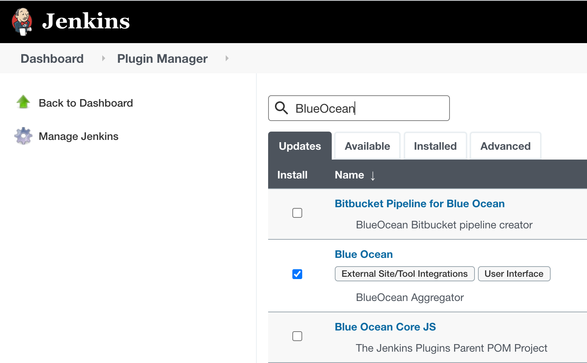
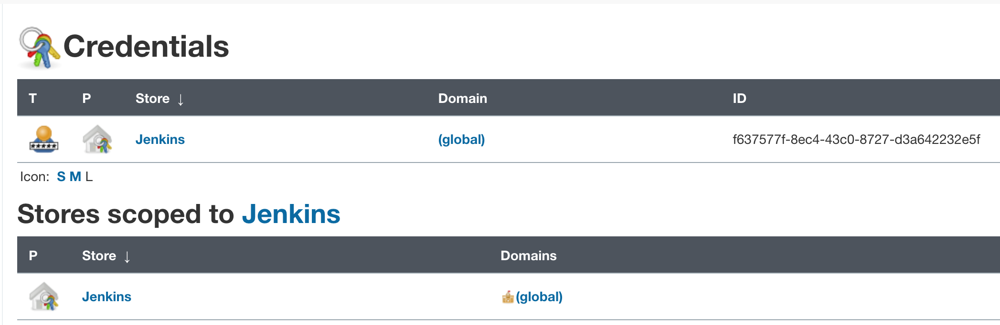
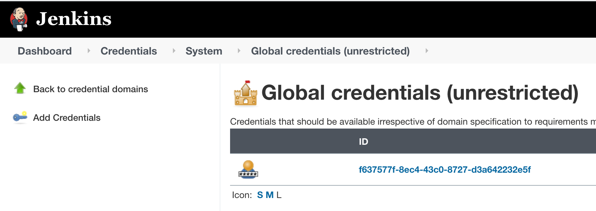
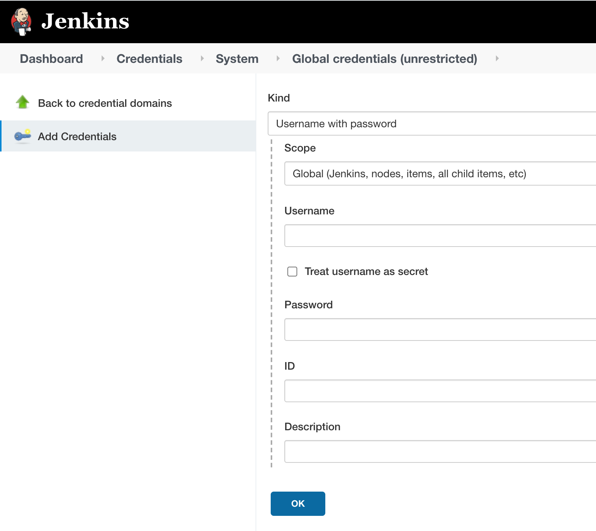
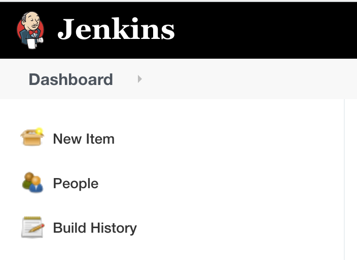
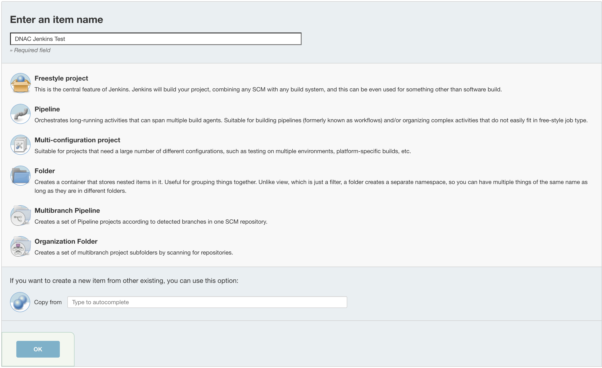
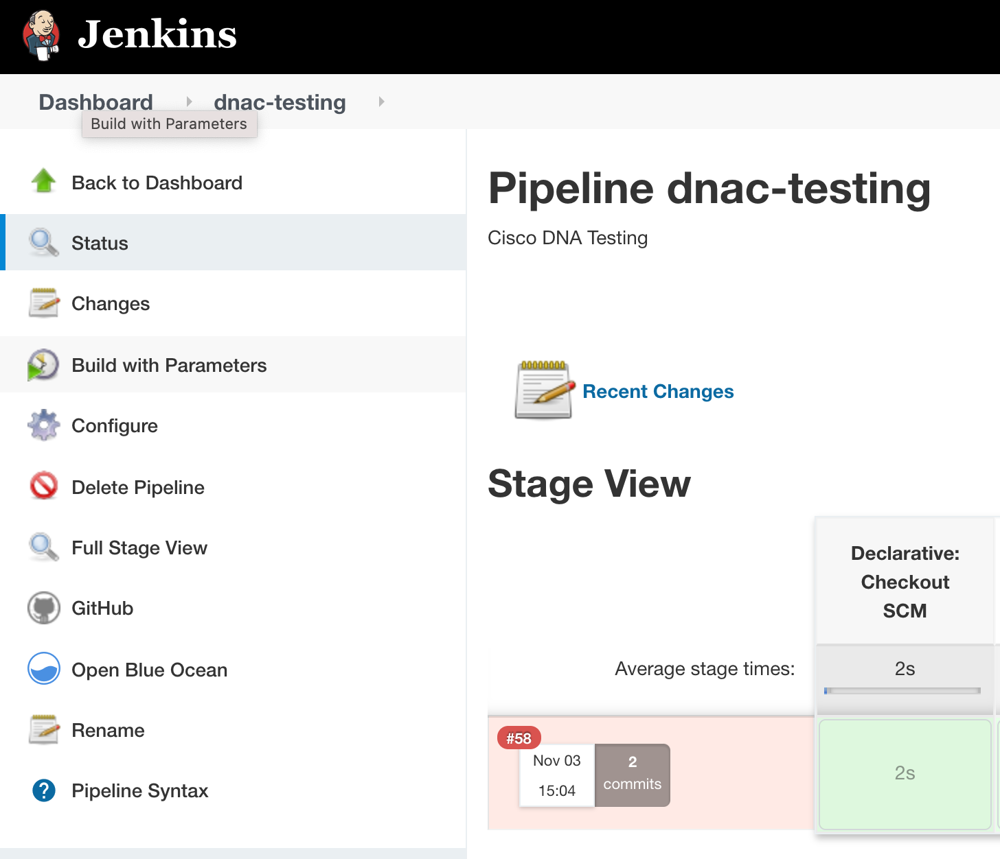

# Cisco DNA Center - Jenkins integration

This repository is an example of how you can integrate Cisco DNA Center with [Jenkins](https://www.jenkins.io/).

## Goal

The goal is to demonstrate how you can leverage the Jenkins pipeline features to deploy configuration templates using Cisco DNA Center APIs.

## Environment

For this demo, the following software or platforms are used:

1. Cisco DNA Center version 2.2.2.3
2. Jenkins 2.303.1
3. Debian GNU/Linux 11
4. Docker
5. Github

## Prerequisites

- Install Jenkins on the Debian server. Follow [this tutorial](https://www.howtoforge.com/how-to-install-jenkins-on-debian-11/)
- Install Docker on the Debian server. Check [this information](https://docs.docker.com/engine/install/debian/#install-from-a-package)

## BlueOcean

To improve the experience using Jenkins, it is highly recommended that the BlueOcean plugin is installed. The installation can be done directly from Jenkins, **Dashboard** -> **Manage Jenkins** -> **Manage Plugins**, there you can select the BlueOcean and scroll down to ask Jenkins to install the plugin.

## Files

The solution files are:

- **Jenkinsfile**: The Jenkins pipeline configuration file. This is the file used to define the steps Jenkins is going to follow during the pipeline process.
- **requirements.txt**: Python requirements file use to install the needed libraries in the docker environment.
- **cli_templates.py**: Python script that reads the `config/cli_templates.yaml` file and deploys configuration templates stored in `templates` using Cisco DNA Center API.
- **sites.py**: Python script that reads the `config/sites.yaml` file and creates a site in Cisco DNA Center.

## Process

1. Once Jenkins and Docker are installed in the Debian server, you will need to clone this repository and upload it to your own Github repository to do testing.
2. Create a Github personal access token to integrate Jenkins with Github
3. Create a Jenkins project with your Github repository information
4. Define environment variables within Jenkins to use during the pipeline process.
5. Trigger a pipeline execution

## Github steps

### Clone repository

Clone the repository in your local machine.

`git clone https://github.com/cisco-en-programmability/dnacenter-jenkins-tutorial.git`

### Create your Github repository

Follow [this link](https://docs.github.com/en/get-started/quickstart/create-a-repo) to create the repository. However, **skip** the step to initialize the repository with a README.

Once you create the repository, move to the cloned repository directory and execute the following:

`git remote set-url origin https://<YOUR REPOSITORY URL>`

This step migrates the URL of the central repository to your repository.

Push the repository to the new one: `git push`

### Create a Github Personal Token

The Github personal token is used to integrate Jenkins with Github. Github does not support to use your username and password to login from another process, nor is it secure to do it.

You can create the Github Personal Token following this [documentation](https://docs.github.com/en/authentication/keeping-your-account-and-data-secure/creating-a-personal-access-token).

You will need to store the token because it will be used to configure the Jenkins pipeline.

## Jenkins Configuration steps

### Credentials

Before creating the new pipeline, you have to create the credentials to access your Github repository.

Go to **Dashboard** -> **Manage Jenkins** -> **Manage Credentials**

You have the select the **Global Domain** and there the **Add credentials** option.

You have to choose the **Username and password** kind where the username will be your GitHub username and the password will be your GitHub personal token created in the last step.

Enter something you will remember for the Description field, like **GitHub DNAC Creds**.

### New pipeline

Create a new pipeline **Dashboard** -> **New Item** -> **Pipeline**.

You can choose the name of the pipeline, it does not have to be the same as the Github repository.
For the purposes of this tutorial, the pipeline will be called: **DNAC Jenkins Test**.
Make sure to select **Pipeline** as the type of item option.

### Pipeline configuration

The Pipeline configuration has multiple tabs:

#### General

- **GitHub Project**: Enter your repository URL
- **This project is parametrized**: Add the following parameters:

  | Parameter           | Type     | Value                               |
  | ------------------- | -------- | ----------------------------------- |
  | DNA_CENTER_USERNAME | String   | DNA Center Username                 |
  | DNA_CENTER_PASSWORD | Password | DNA Center Password                 |
  | DNA_CENTER_DEBUG    | String   | False                               |
  | DNA_CENTER_BASE_URL | String   | DNA Center IP or FQDN with https:// |
  | DNA_CENTER_VERIFY   | String   | False                               |

#### Build triggers

For this tutorial, we do not have to select an option here because we will trigger the pipeline execution manually, but here is where you can decide when do you want the pipeline to be executed.

#### Advanced Project options

Select the **Pipeline script from SCM** option and configure it with the following information:

| Parameter        | Type                                      |
| ---------------- | ----------------------------------------- |
| SCM              | Git                                       |
| Repository URL   | Enter your repository URL                 |
| Credentials      | Enter your previously created credentials |
| Branch Specifier | \*/main                                   |
| Script Path      | Jenkinsfile                               |

Save the configuration.

## Jenkins Build Steps

Once you are done with the configuration, you should be able to access the pipeline and trigger the build with the **Build with parameters** button.

There you can trigger the pipeline manually. If you installed the BlueOcean plugin, you should have a button on the left that will take you to more friendly pipeline interface.
